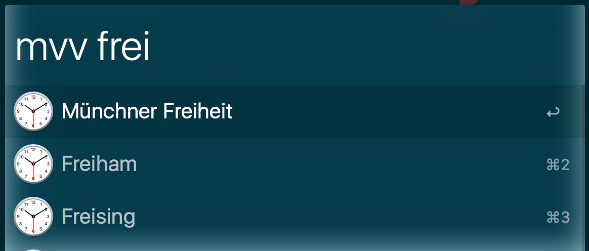
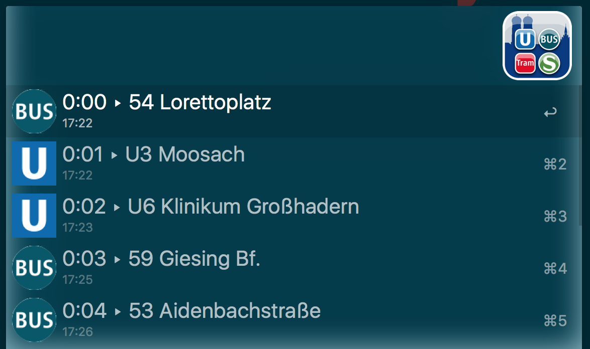
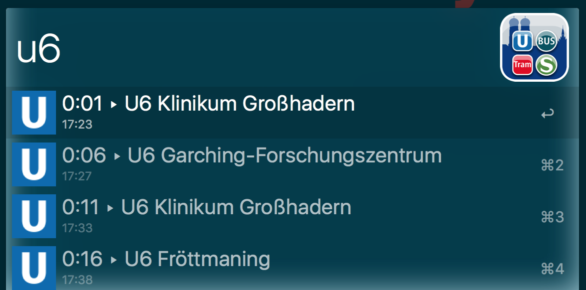

# MVV-Abfahrtmonitor für Alfred

Dieser [Alfred-Workflow](http://www.alfredapp.com) macht den Abfahrtsmonitor des Münchner Nahverkehrs (MVV/MVG) in Alfred zugänglich.
Das Schlüsselwort ist `mvv`.

Zuerst muss eine Station geucht und ausgewählt werden. Im zweiten Schritt wird der Abfahrtsmonitor angezeigt. Dieser kann weiter gefiltert werden, um beispielsweise nur Abfahren einer betimmten Linie anzuzeigen.

## Station suchen
Stationen werden per Text gesucht. Die Ergebnisliste wird während der Eingabe aktualisiert.

Die gewünschte Station dann mit <kbd>Enter</kbd> auswählen. Der Abfahrtsmonitor erscheint und zeigt für alle Abfahren
- Linie
- Endstation
- Abfahrtsuhrzeit
- verbleibende Zeit bis zur Abfahrt in Minuten

Durch Texteingabe kann die Liste weiter gefiltert werden, z.B.
- `U6`
- `23`
- `Klinik`
- `GF` (für Garching Forschungszentrum)

## Favoriten verwalten
Stationen können als Favorit gespeichert werden. Dann erscheinen sie sofort nach Eingabe von `mvv` ohne einen Suchtext einzugeben. Dazu wie folgt vorgehen:

1. Station suchen
2. Mit <kbd>CMD</kbd> + <kbd>Enter</kbd> auswählten (anstelle von nur <kbd>Enter</kbd>)

Zum Entfernen von Favoriten genauso vorgehen wie beim Hinzufügen. Stationen, die noch kein Favorit sind, werden auf diese Weise als Favorit gespeichert. Ist die Station bereits ein Favorit, wird sie aus den Favoriten entfernt.
